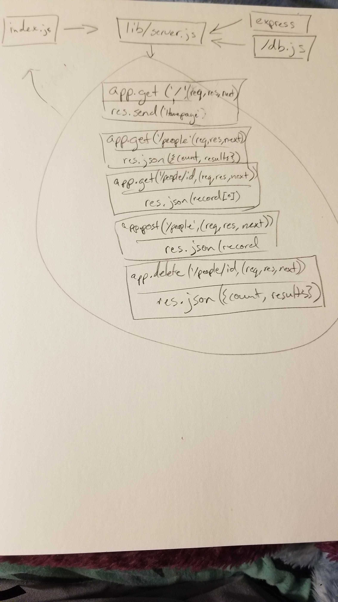

# LAB - 07 Express

### Author: Morgan T Shaw

### Links and Resources
* [submission PR](https://github.com/morgan-401-advanced-javascript/lab07/pull/1)
* [travis](https://www.travis-ci.com/morgan-401-advanced-javascript/lab07)
* [front-end](https://lab07mts.herokuapp.com/)

#### Documentation
* [api docs](http://xyz.com) (API servers)
* [jsdoc](./docs/config/) (Server assignments)

### Modules
#### `people-routes.js`
#### `teams-routes.js`

##### Exported Values and Methods

###### `foo(thing) -> string`
Usage Notes or examples

###### `bar(array) -> array`
Usage Notes or examples

### Setup
#### `.env` requirements
* `PORT` - Port Number
* `MONGODB_URI` - URL to the running mongo instance/db

#### Running the app
* `npm start`
* Endpoint: `/foo/bar/`
  * Returns a JSON object with abc in it.
* Endpoint: `/bing/zing/`
  * Returns a JSON object with xyz in it.
  
#### Tests
* How do you run tests?
npm test
* What assertions were made?
* What assertions need to be / should be made?

#### UML
